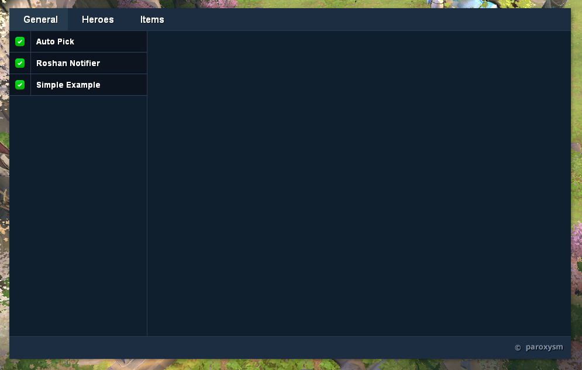
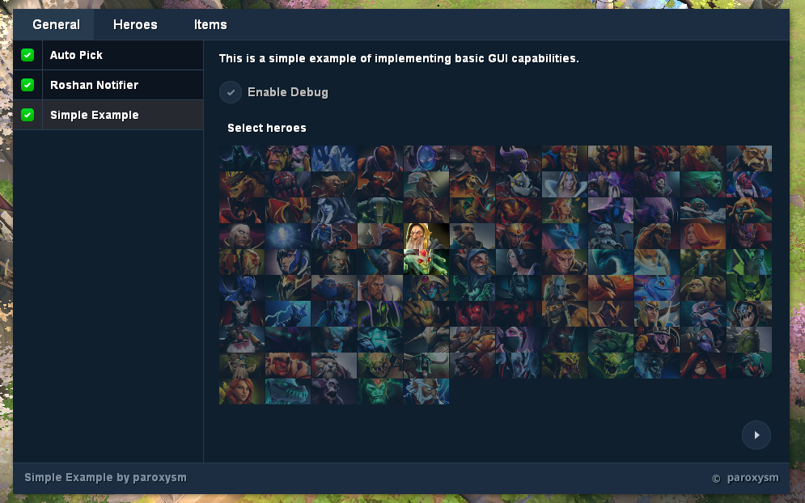
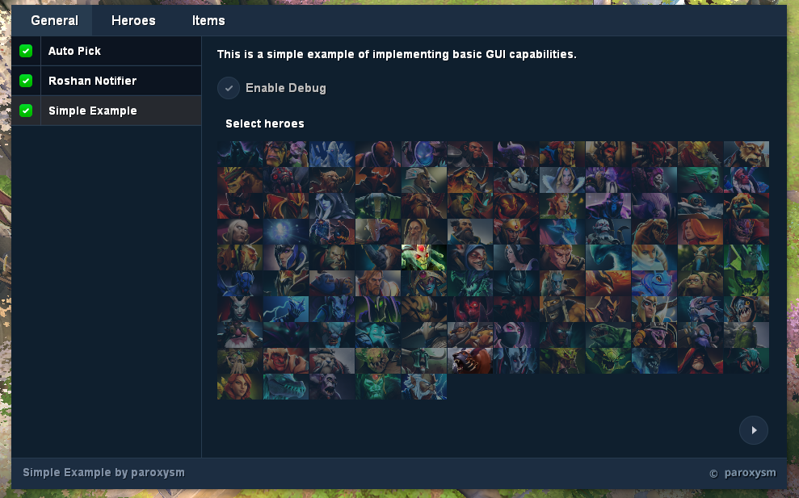
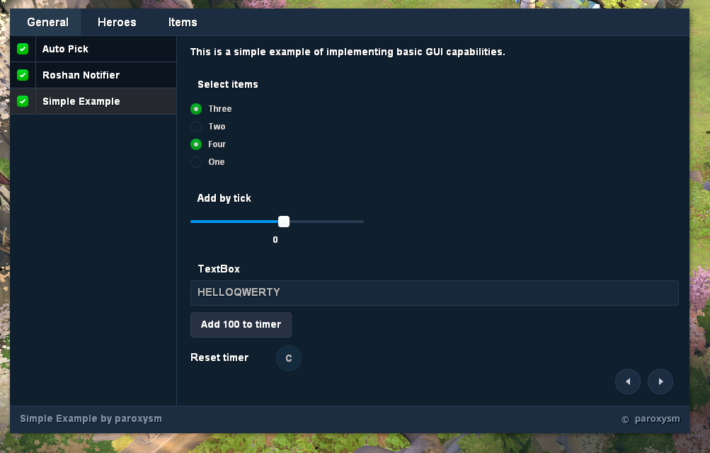
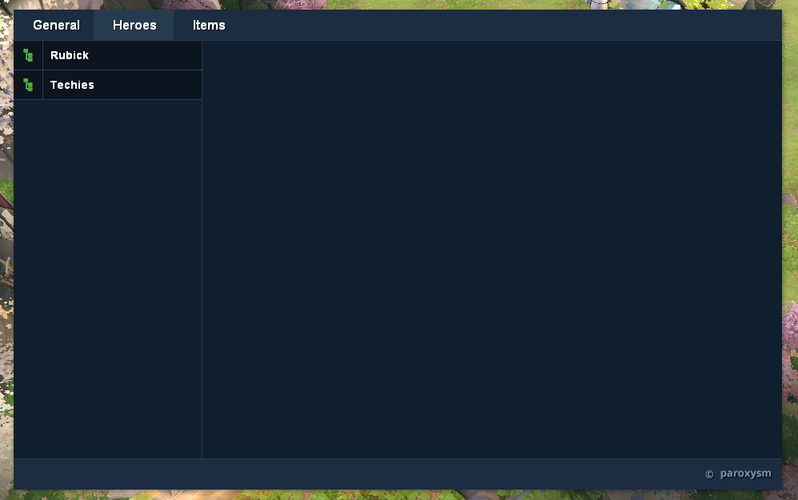

"I did not know how to start, so I came up with and wrote this phrase".
## Screenshoot's

## A short How To

1. Download GUI.lua
2. Put it in hake/scripts/ folder
3. Download [images](./images.zip) and extract it in /hake/ folder
4. Run Hake.me
5. Enable GUI in "GUI" menu
6. Press "~" key, enjoy!

## DOCUMENTATION FOR DEVELOPERS

Full documentation you can find here

- [GLOBAL](https://github.com/paroxysmofhappiness/GUI/wiki/GLOBAL)
- [CONTROLS](https://github.com/paroxysmofhappiness/GUI/wiki/CONTROLS)
- [ADDITIONAL](https://github.com/paroxysmofhappiness/GUI/wiki/ADDITIONAL)
- [THEMING](https://github.com/paroxysmofhappiness/GUI/wiki/THEMING)
- [SIMPLE EXAMPLE](https://github.com/paroxysmofhappiness/GUI/wiki/SIMPLE-EXAMPLE)

## Contributing to this project

If you've improved GUI and think that other people would enjoy it, submit a pull request. Anyone and everyone is welcome to contribute.
